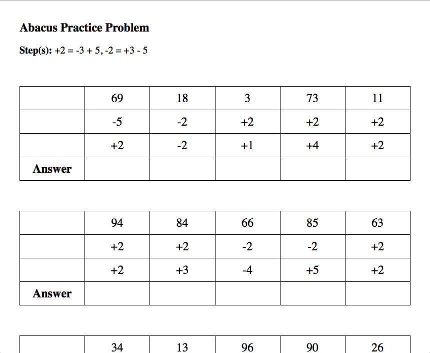

```buildoutcfg
Developer's note:
The file readme.md is program generated. Do not edit it. Edit readmeTemplate.md instead.
```

**Introduction**

The python program *Abacus* generates random practice problems for [abacus](https://en.wikipedia.org/wiki/Abacus). The
main features are:
* interactive interface that allows you to customize the problems for a specific set of skills
* printer-friendly HTML output

**Prerequisite**

Install Python 3.7.4 or later. See [Download Python](https://www.python.org/downloads/).


**Usage**

Clone this repository, cd into the repository root folder, and then run `python3 abacus.py` (or `python abacus.py` depending on your environment). In the console, you will
see the complete list of steps and will be asked to enter the steps you want to practice. You may enter a range (e.g. 1-3), a number (e.g. 5), or a mix of both separated by commas (e.g. 1-3, 5).

```buildoutcfg
Step 1: Simple addition or subtraction
Step 2: Simple addition or subtraction (allow upper bead)
Step 3: +1 = -4 + 5
Step 4: -1 = +4 - 5
Step 5: +1 = -4 + 5, -1 = +4 - 5
Step 6: +2 = -3 + 5
Step 7: -2 = +3 - 5
Step 8: +2 = -3 + 5, -2 = +3 - 5
Step 9: +3 = -2 + 5
Step 10: -3 = +2 - 5
Step 11: +3 = -2 + 5, -3 = +2 - 5
Step 12: +4 = -1 + 5
Step 13: -4 = +1 - 5
Step 14: +4 = -1 + 5, -4 = +1 - 5
Step 15: Combo - steps 5, 8, 11, 14
Step 16: No carry or borrow
Step 17: +5 = -5 + 10
Step 18: -5 = +5 - 10
Step 19: +5 = -5 + 10, -5 = +5 - 10
Step 20: +6 = -4 + 10
Step 21: -6 = +4 - 10
Step 22: +6 = -4 + 10, -6 = +4 - 10
Step 23: +7 = -3 + 10
Step 24: -7 = +3 - 10
Step 25: +7 = -3 + 10, -7 = +3 - 10

Choose steps (e.g. 1-3, 5):
```

**Output**

After you enter the steps, two HTML files will be generated.
* output/steps.html
* output/problems.html

The first file contains the complete list of steps for your reference. The second file is a well-formatted HTML
document which you may print out.

