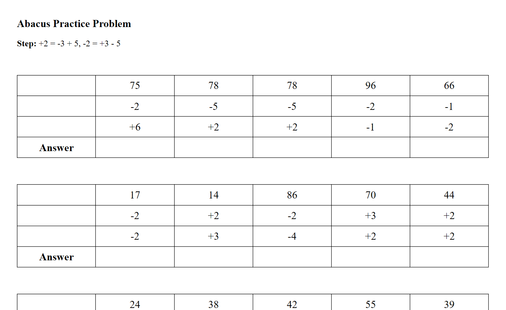

```buildoutcfg
Developer's note: The file readme.md is program generated. Do not edit the file readme.md. Edit readmeTemplate.md instead.
```

**Introduction**

The python program *Abacus* generates random practice problems for [abacus](https://en.wikipedia.org/wiki/Abacus). The
main features are:
* interactive interface that allows you to customize the problems for a specific set of skills
* printer-friendly HTML output

**Prerequisite**

Install Python 3.7.4 or later. See [Download Python](https://www.python.org/downloads/).


**Usage**

Clone this repository, cd into the repository root folder, and then run `python3 abacus.py`. In the console, you will
see the complete list of steps and will be asked to enter the steps you want to practice.

```buildoutcfg
{steps}

Choose steps (e.g. 1-3, 5):
```

**Output**

After you enter the steps, two HTML files will be generated.
* output/steps.html
* output/problems.html

The first file contains the complete list of steps for your reference. The second file is a well-formatted HTML
document which you may print out.

